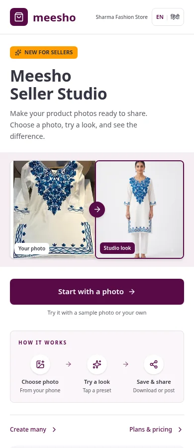
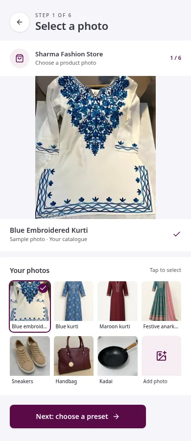
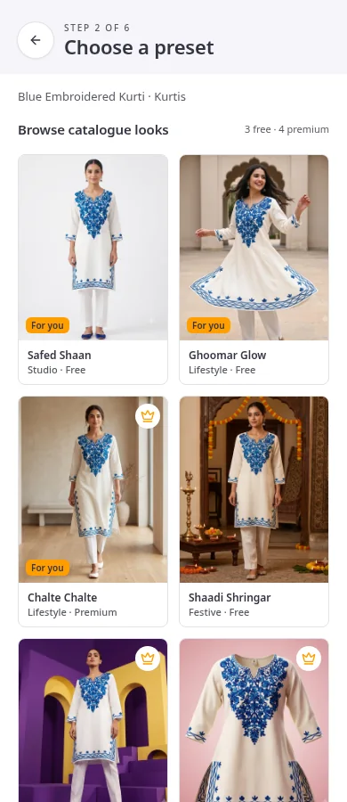
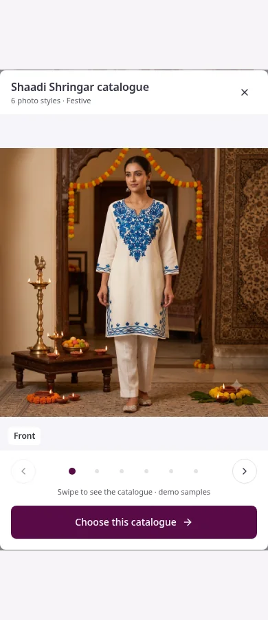
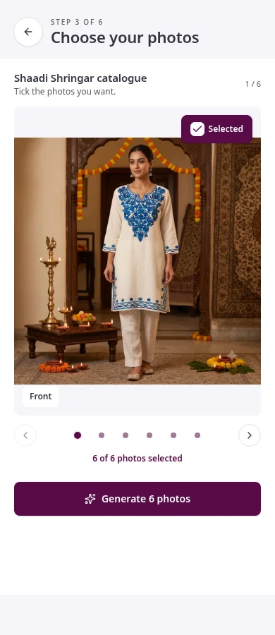
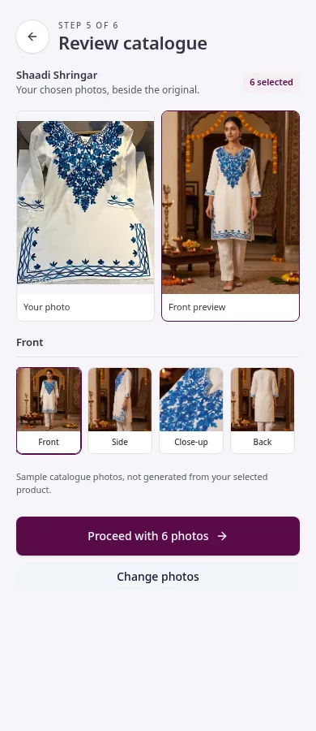
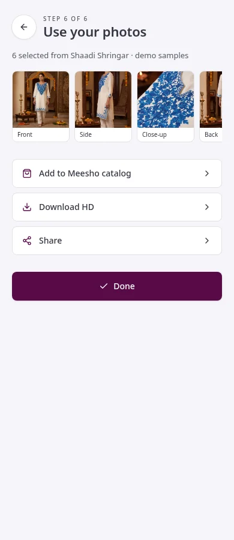
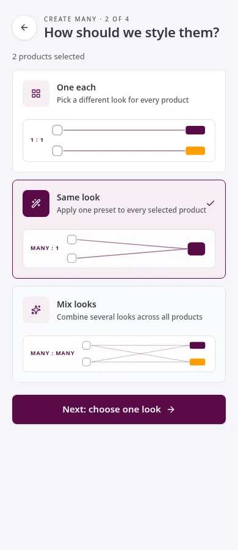
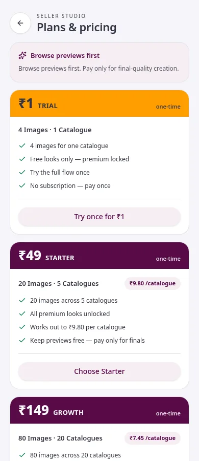

# Meesho Seller Studio

**A mobile-first prototype for creating product catalogues without a studio shoot or prompt-writing.** Built by **Team Adjusted EBITDA, IIT Kanpur** (Aayushman Kumar, Satyansh Sharma and Shagun Chaudhary) for the **Meesho Season 3 DICE Challenge**.

Seller Studio explores a guided way for a Meesho seller to start with a real product photo, browse culturally relevant catalogue looks, choose the shots they need and review the resulting set. The idea is to make professional-looking, consistent product content more accessible while keeping the original product as the source of truth. This repository is an interactive **concept prototype**, not an official Meesho product or a production catalogue pipeline.

## Try the prototype

[Open the live preview](https://meesho-seller-studio.lovable.app) on a phone or in a narrow browser window. It is designed around a 390px-wide seller experience.

1. Tap **Start with a photo** and choose a sample product or upload a photo.
2. Watch the brief product-understanding pop-up, then browse presets and swipe through each preset's catalogue preview.
3. Choose a preset, tick the shots you want and tap **Generate**.
4. Review the before-and-after catalogue selection, then download or share the selected photos.

## Screenshots

Each screen of the guided flow, in order. Images are demo samples included with the prototype.

<p align="center">
  
  <br />
  <b>1. Home</b> — the seller's starting point: start with a photo, switch English/Hindi, toggle demo mode.
</p>

<p align="center">
  
  <br />
  <b>2. Choose a photo</b> — pick a sample product (kurti, shoes, handbag, cookware) or upload a real product photo.
</p>

<p align="center">
  
  <br />
  <b>3. Presets</b> — browse catalogue looks; each card previews the full photo set before you commit.
</p>

<p align="center">
  
  <br />
  <b>4. Catalogue gallery</b> — swipe through every shot in a look (front, side, close-up, back, sleeve, dimensions) and tick the ones you want.
</p>

<p align="center">
  
  <br />
  <b>5. Select shots</b> — confirm the selected photos and tap Generate for the whole catalogue set.
</p>

<p align="center">
  
  <br />
  <b>6. Review catalogue</b> — before/after comparison of the original product photo against each generated shot.
</p>

<p align="center">
  
  <br />
  <b>7. Save</b> — add to the Meesho catalogue, download HD photos, or share.
</p>

<p align="center">
  
  <br />
  <b>8. Create many</b> — style multiple products at once: one look per product, one look across products, or mixed looks.
</p>

<p align="center">
  
  <br />
  <b>9. Plans</b> — illustrative one-time packs from Trial ₹1 to Pro ₹549 with per-catalogue limits.
</p>

You can also try **Create many** for one look per product, one look across several products, or multiple looks across several products. The floating voice assistant demonstrates a scripted Hindi/Hinglish request that navigates the screens automatically. The first screen includes an English/Hindi switch for its introductory content and a demo-mode switch.

## What the prototype shows

- **Category-aware journey:** hard-coded sample profiles for kurtis, shoes, handbags and cookware suggest category-specific shot plans and relevant preset families.
- **Catalogue-first browsing:** seven named kurti looks use supplied front, side, close-up, back, sleeve and dimensions photos; sellers preview a set before selecting individual shots.
- **Bulk styling:** one-to-one, many-to-one and many-to-many look assignments with visual relation diagrams and before/after results.
- **Voice walkthrough:** a scripted request for a festive blue-kurti photo visibly selects the product, opens Shaadi Shringar and browses all six photos before reaching shot selection.
- **Illustrative one-time packs:** Trial ₹1 (4 images / 1 catalogue), Starter ₹49 (20 / 5), Growth ₹149 (80 / 20) and Pro ₹549 (320 / 80). Selecting a pack changes the demo's catalogue-at-a-time limit; premium looks are unavailable on Trial. No payment is collected.

## Prototype boundaries

**Offline is the default.** The catalogue flow displays local sample imagery rather than generating a new catalogue, and switching the demo to online turns catalogue creation into illustrative live generation with a GenAI backend. Non-kurti previews use illustrative treatments of sample images. The product-understanding profiles, voice actions and fidelity indicators are simulated; they are **not** live category detection, speech recognition or verified product-fidelity checks. Downloads contain the selected demo images, not newly generated edits of an uploaded product.

The repository also contains a separate server-side experimental image-edit endpoint. The deck's proposed automated inference, fidelity gate and production integrations are a **vision for further validation**, not capabilities delivered by this prototype.

## Run locally

Requires a current Node.js runtime and [Bun](https://bun.sh/). From a local checkout:

```sh
bun install
bun run dev
```

Open the local address printed by Vite. The default offline walkthrough uses the included sample assets; any experimental image-edit endpoint requires its own server-side gateway configuration.

## Technology

React 19, TypeScript, TanStack Start, Vite and Tailwind CSS. The interface and demo state are local to the app; category profiles live in a deterministic inference module, and sample photos are served as project assets.
